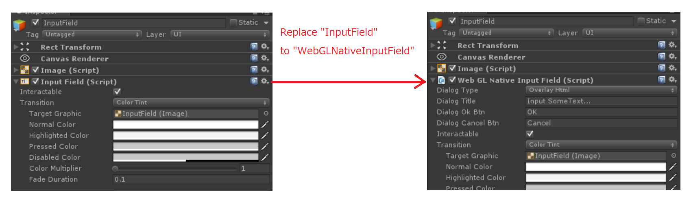
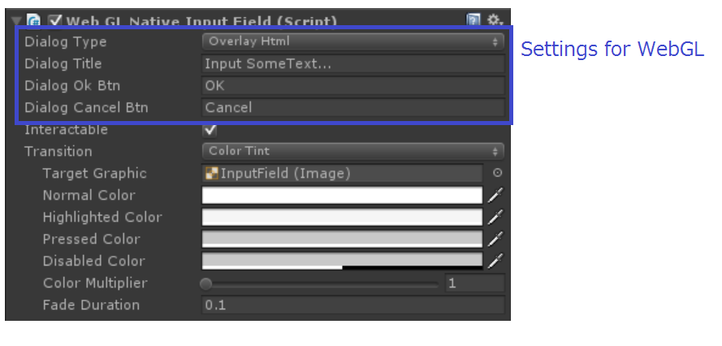
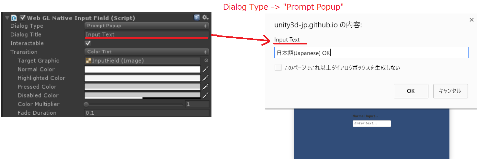
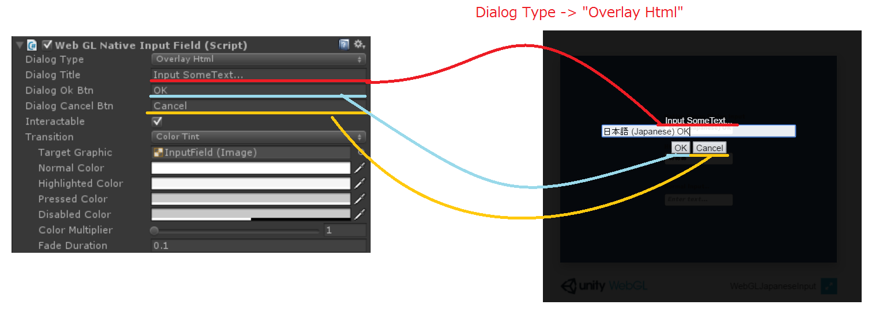
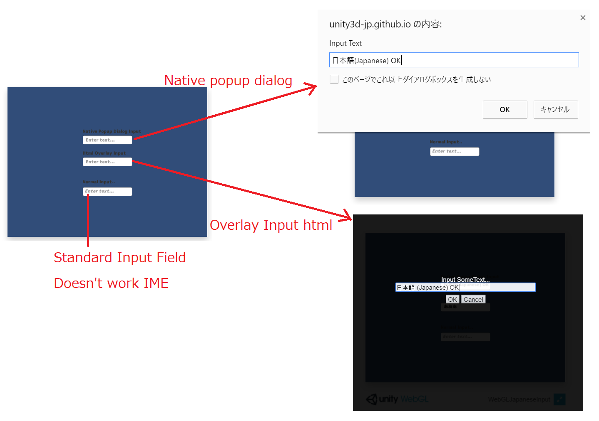

# WebGLNativeInputField
Read this in other languages: [English](README.md), 日本語 
 
## 概要

UnityのWebGLで日本語入力を可能にします。 
 
## 使い方 
InputFieldの代わりに、こちらで用意しました「WebGLNativeInputField」を利用下さい。 
WEBGLで実行したときにのみNativeのインプットを利用するようになっています。 
  
 
ダイアログの方式は下記の二種類用意しました。 
どちらを使うかなどの設定はInspector上で出来ます。 
 
 
1.JavaScriptからポップアップダイアログを出して入力する方式 
 
 
2.HTMLを動的に生成して、ゲーム画面の上に入力フォームを呼び出す形式 
 
 

## 実行デモは下記になります 
https://unity3d-jp.github.io/WebGLNativeInputField/  

このように動きます

